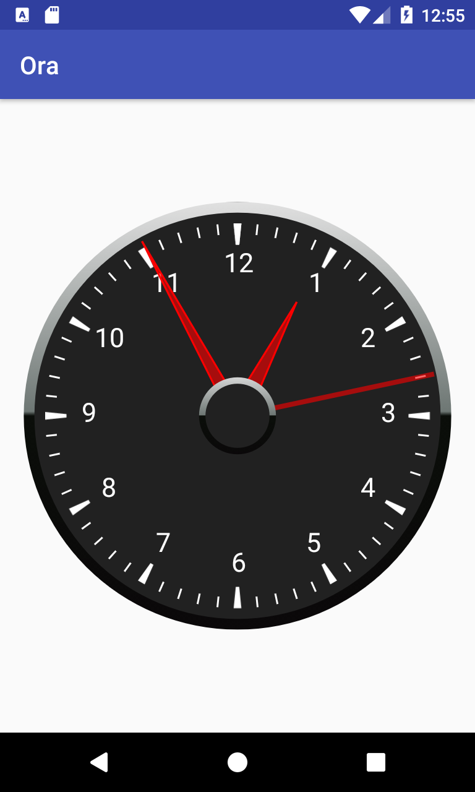

# java-android-ora

Ora means time in malagasy, this is just an analog clock rendering on Android.

We extend an Android Class named View, then overide methods in it to render and draw the clock.

***Here is the result***

## More info
 - [koor.fr](https://koor.fr/Java/Android/ClockSample.wp)